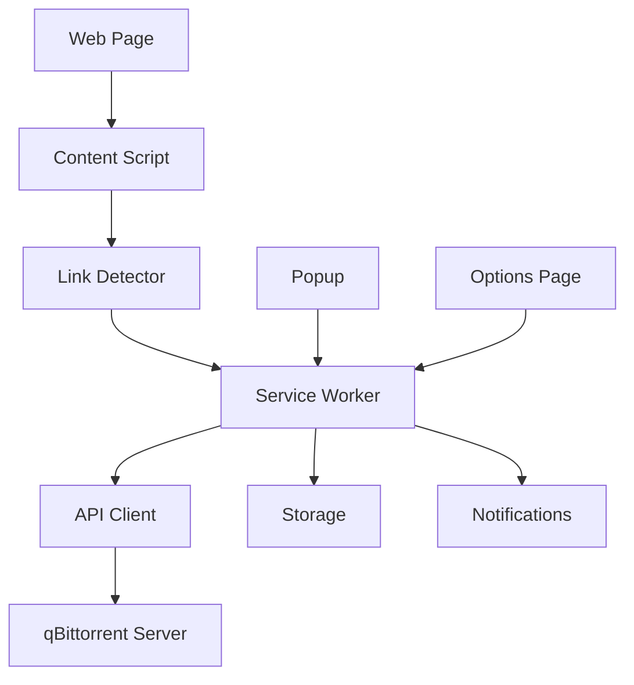

# API Documentation

This document provides comprehensive technical documentation for developers working with the qBittorrent Web Integration browser extension.

## Table of Contents

1. [Architecture Overview](#architecture-overview)
2. [Extension APIs](#extension-apis)
3. [qBittorrent Web API Integration](#qbittorrent-web-api-integration)
4. [Message Passing Architecture](#message-passing-architecture)
5. [Storage Schema](#storage-schema)
6. [Security Implementation](#security-implementation)
7. [Error Handling](#error-handling)
8. [Extension Points](#extension-points)

## Architecture Overview

### Extension Components

The extension follows a modular Manifest V3 architecture:

```
qbittorrent-extension/
├── background/           # Service Worker & API Client
│   ├── service-worker.js # Main background script
│   └── api-client.js     # qBittorrent API integration
├── content/              # Content Scripts
│   ├── content-script.js # Main content script
│   └── link-detector.js  # Torrent link detection
├── popup/                # Extension Popup
│   ├── popup.html        # Popup interface
│   ├── popup.css         # Popup styling
│   └── popup.js          # Popup logic
├── options/              # Options Page
│   ├── options.html      # Settings interface
│   ├── options.css       # Settings styling
│   └── options.js        # Settings logic
└── utils/                # Utility Modules
    ├── constants.js      # Constants and defaults
    ├── crypto.js         # Encryption utilities
    ├── validation.js     # Input validation
    └── notifications.js  # Notification system
```

### Data Flow



## Extension APIs

### Service Worker API

The main service worker ([`background/service-worker.js`](background/service-worker.js)) provides the core extension functionality.

#### Message Handlers

```javascript
// Message types handled by service worker
const MESSAGE_TYPES = {
    SEND_TORRENT: 'SEND_TORRENT',
    SEND_MULTIPLE: 'SEND_MULTIPLE',
    TEST_CONNECTION: 'TEST_CONNECTION',
    GET_SERVER_INFO: 'GET_SERVER_INFO',
    UPDATE_BADGE: 'UPDATE_BADGE'
};
```

#### `SEND_TORRENT` Message

Sends a single torrent to qBittorrent.

**Request:**
```javascript
chrome.runtime.sendMessage({
    action: 'SEND_TORRENT',
    url: 'magnet:?xt=urn:btih:...',
    options: {
        category: 'movies',
        savePath: '/downloads/movies',
        paused: false,
        skipHashCheck: false
    }
});
```

**Response:**
```javascript
{
    success: true,
    result: {
        name: 'Torrent Name',
        hash: 'abc123...'
    }
}
```

#### `SEND_MULTIPLE` Message

Sends multiple torrents to qBittorrent.

**Request:**
```javascript
chrome.runtime.sendMessage({
    action: 'SEND_MULTIPLE',
    urls: ['magnet:?xt=...', 'https://example.com/file.torrent'],
    options: {
        category: 'movies',
        paused: true
    }
});
```

**Response:**
```javascript
{
    success: true,
    results: [
        { url: 'magnet:?xt=...', success: true, result: {...} },
        { url: 'https://...', success: false, error: 'Connection failed' }
    ]
}
```

#### `TEST_CONNECTION` Message

Tests connectivity to qBittorrent server.

**Request:**
```javascript
chrome.runtime.sendMessage({
    action: 'TEST_CONNECTION'
});
```

**Response:**
```javascript
{
    success: true,
    connected: {
        version: '4.5.0',
        webPort: 8080
    }
}
```

### Content Script API

Content scripts ([`content/content-script.js`](content/content-script.js)) handle torrent detection and user interaction.

#### TorrentLinkDetector Class

```javascript
class TorrentLinkDetector {
    constructor() {
        this.magnetPattern = /magnet:\?xt=urn:btih:[a-zA-Z0-9]{32,40}/gi;
        this.torrentPattern = /\.torrent(\?[^"'\s]*)?$/i;
        this.detectedLinks = new Set();
        this.linkElements = new WeakMap();
    }

    // Detect all torrent links on the page
    detectAllLinks() {
        const links = [];
        this.findMagnetLinks().forEach(link => links.push(link));
        this.findTorrentFileLinks().forEach(link => links.push(link));
        return links;
    }

    // Add visual indicators to detected links
    addLinkIndicators() {
        const links = this.detectAllLinks();
        links.forEach(link => {
            if (link.element && !link.element.classList.contains('qbt-detected')) {
                this.addIndicator(link.element, link.type);
            }
        });
    }
}
```

#### Content Script Messages

**`GET_ALL_TORRENTS` Handler:**
```javascript
chrome.runtime.onMessage.addListener((message, sender, sendResponse) => {
    switch (message.action) {
        case 'GET_ALL_TORRENTS':
            if (detector) {
                const torrents = detector.detectAllLinks();
                sendResponse({ torrents: torrents.map(t => t.url) });
            }
            break;
    }
});
```

## qBittorrent Web API Integration

### Authentication

The extension uses cookie-based authentication with the qBittorrent Web API.

```javascript
async function authenticate() {
    const { server } = await getSettings();
    
    const loginUrl = `${server.url}/api/v2/auth/login`;
    const formData = new FormData();
    formData.append('username', server.username);
    formData.append('password', server.password);

    const response = await fetch(loginUrl, {
        method: 'POST',
        body: formData,
        credentials: 'include'
    });

    if (response.ok && await response.text() === 'Ok.') {
        // Extract and store auth cookie
        const setCookieHeader = response.headers.get('set-cookie');
        if (setCookieHeader) {
            authCookie = setCookieHeader.split(';')[0];
            lastAuthTime = Date.now();
        }
        return authCookie;
    }
    
    throw new Error('Authentication failed');
}
```

### API Endpoints Used

| Endpoint | Method | Purpose | Response |
|----------|--------|---------|----------|
| `/api/v2/auth/login` | POST | Authentication | 'Ok.' or error |
| `/api/v2/app/version` | GET | Get qBittorrent version | Version string |
| `/api/v2/app/preferences` | GET | Get server preferences | JSON object |
| `/api/v2/torrents/add` | POST | Add torrent | 'Ok.' or error |
| `/api/v2/torrents/info` | GET | Get torrent list | JSON array |

### Torrent Upload

```javascript
async function sendTorrent(torrentUrl, customOptions = {}) {
    const { options } = await getSettings();
    const formData = new FormData();

    if (torrentUrl.startsWith('magnet:')) {
        formData.append('urls', torrentUrl);
    } else {
        // Handle .torrent file
        const torrentResponse = await fetch(torrentUrl);
        const torrentBlob = await torrentResponse.blob();
        
        // Security: Check file size (10MB limit)
        if (torrentBlob.size > 10 * 1024 * 1024) {
            throw new Error('Torrent file too large');
        }
        
        formData.append('torrents', torrentBlob, 'download.torrent');
    }

    // Add download options
    if (options.category || customOptions.category) {
        formData.append('category', customOptions.category || options.category);
    }
    
    if (options.savePath || customOptions.savePath) {
        formData.append('savepath', customOptions.savePath || options.savePath);
    }

    const response = await makeAuthenticatedRequest('torrents/add', {
        method: 'POST',
        body: formData
    });

    return { success: true, name: extractTorrentName(torrentUrl) };
}
```

## Message Passing Architecture

### Chrome Extension Messaging

The extension uses Chrome's message passing API for communication between components.

#### Background ↔ Content Script

```javascript
// Content Script → Background
chrome.runtime.sendMessage({
    action: 'SEND_TORRENT',
    url: 'magnet:?xt=...'
}, (response) => {
    if (response.success) {
        console.log('Torrent sent successfully');
    }
});

// Background → Content Script
chrome.tabs.sendMessage(tabId, {
    action: 'GET_ALL_TORRENTS'
}, (response) => {
    console.log('Found torrents:', response.torrents);
});
```

#### Background ↔ Popup

```javascript
// Popup → Background
chrome.runtime.sendMessage({
    action: 'TEST_CONNECTION'
}, (response) => {
    updateConnectionStatus(response.connected);
});
```

### Rate Limiting

The extension implements rate limiting to prevent abuse:

```javascript
class RateLimiter {
    constructor() {
        this.requests = new Map();
    }
    
    isAllowed(key, maxRequests, timeWindow) {
        const now = Date.now();
        const requests = this.requests.get(key) || [];
        
        // Remove old requests
        const validRequests = requests.filter(time => now - time < timeWindow);
        
        if (validRequests.length >= maxRequests) {
            return false;
        }
        
        validRequests.push(now);
        this.requests.set(key, validRequests);
        return true;
    }
}

// Usage in service worker
const rateLimiter = new RateLimiter();

chrome.runtime.onMessage.addListener((message, sender, sendResponse) => {
    const senderKey = sender.tab ? sender.tab.id.toString() : 'popup';
    
    if (!rateLimiter.isAllowed(senderKey, 20, 60000)) { // 20 requests per minute
        sendResponse({ success: false, error: 'Rate limit exceeded' });
        return;
    }
    
    // Process message...
});
```

## Storage Schema

### Chrome Storage Sync

Settings are stored using Chrome's sync storage API:

```javascript
// Storage structure
const STORAGE_SCHEMA = {
    server: {
        url: 'string',           // qBittorrent server URL
        username: 'string',      // Username for authentication
        password: 'string',      // Password (encrypted)
        useHttps: 'boolean',     // Force HTTPS connections
        customPort: 'number'     // Custom port number
    },
    options: {
        category: 'string',      // Default category
        savePath: 'string',      // Default save path
        paused: 'boolean',       // Start torrents paused
        skipHashCheck: 'boolean', // Skip hash verification
        autoDownload: 'boolean', // Auto-intercept torrent links
        showNotifications: 'boolean', // Show success/error notifications
        showIndicators: 'boolean',    // Show link indicators
        scanDynamicContent: 'boolean' // Monitor dynamic content
    },
    siteSettings: {
        whitelist: 'array',      // Allowed domains
        blacklist: 'array'       // Blocked domains
    },
    advanced: {
        connectionTimeout: 'number', // Request timeout (seconds)
        retryAttempts: 'number',     // Number of retry attempts
        debugLogging: 'boolean'      // Enable debug logging
    }
};
```

### Storage Manager Utility

```javascript
class StorageManager {
    static async get(keys = null) {
        return new Promise((resolve) => {
            chrome.storage.sync.get(keys, resolve);
        });
    }

    static async set(items) {
        return new Promise((resolve) => {
            chrome.storage.sync.set(items, resolve);
        });
    }

    static async getServerSettings() {
        const result = await this.get(['server']);
        return result.server || CONSTANTS.DEFAULTS.SERVER;
    }

    static async getOptions() {
        const result = await this.get(['options']);
        return { ...CONSTANTS.DEFAULTS.OPTIONS, ...result.options };
    }
}
```

### Secure Credential Storage

Sensitive data is encrypted before storage:

```javascript
class SecureStorageManager {
    static async storeCredentials(credentials) {
        const encrypted = await CryptoUtil.encrypt(JSON.stringify(credentials));
        await chrome.storage.local.set({ 
            encryptedCredentials: encrypted 
        });
    }

    static async getCredentials() {
        const result = await chrome.storage.local.get(['encryptedCredentials']);
        if (result.encryptedCredentials) {
            const decrypted = await CryptoUtil.decrypt(result.encryptedCredentials);
            return JSON.parse(decrypted);
        }
        return null;
    }
}
```

## Security Implementation

### Encryption Utilities

The extension uses AES-GCM encryption for sensitive data:

```javascript
class CryptoUtil {
    static async generateKey() {
        return await crypto.subtle.generateKey(
            { name: 'AES-GCM', length: 256 },
            true,
            ['encrypt', 'decrypt']
        );
    }

    static async encrypt(plaintext) {
        const key = await this.getOrCreateKey();
        const iv = crypto.getRandomValues(new Uint8Array(12));
        
        const encoded = new TextEncoder().encode(plaintext);
        const ciphertext = await crypto.subtle.encrypt(
            { name: 'AES-GCM', iv: iv },
            key,
            encoded
        );

        return {
            ciphertext: Array.from(new Uint8Array(ciphertext)),
            iv: Array.from(iv)
        };
    }

    static async decrypt(encryptedData) {
        const key = await this.getOrCreateKey();
        const iv = new Uint8Array(encryptedData.iv);
        const ciphertext = new Uint8Array(encryptedData.ciphertext);

        const decrypted = await crypto.subtle.decrypt(
            { name: 'AES-GCM', iv: iv },
            key,
            ciphertext
        );

        return new TextDecoder().decode(decrypted);
    }
}
```

### Input Validation

All inputs are validated using a comprehensive validation system:

```javascript
class InputValidator {
    static validateServerUrl(url) {
        const pattern = /^https?:\/\/([\w\-\.]+)(:\d{1,5})?$/i;
        if (!pattern.test(url)) {
            return { valid: false, error: 'Invalid server URL format' };
        }
        
        const urlObj = new URL(url);
        const port = parseInt(urlObj.port) || (urlObj.protocol === 'https:' ? 443 : 80);
        
        if (port < 1 || port > 65535) {
            return { valid: false, error: 'Invalid port number' };
        }
        
        return { valid: true, sanitized: url.trim().toLowerCase() };
    }

    static validateMagnetLink(magnetUrl) {
        const pattern = /^magnet:\?xt=urn:btih:[a-fA-F0-9]{32,40}/;
        return pattern.test(magnetUrl);
    }

    static sanitizeFilename(filename) {
        // Remove dangerous characters
        return filename.replace(/[<>:"/\\|?*\x00-\x1f]/g, '_')
                      .substring(0, 255);
    }

    static validateFormData(formData) {
        const errors = [];
        const sanitized = {};

        // Validate server settings
        if (formData.server) {
            const urlValidation = this.validateServerUrl(formData.server.url);
            if (!urlValidation.valid) {
                errors.push(`Server URL: ${urlValidation.error}`);
            } else {
                sanitized.server = {
                    ...formData.server,
                    url: urlValidation.sanitized
                };
            }
        }

        return {
            isValid: errors.length === 0,
            errors: errors,
            sanitizedData: sanitized
        };
    }
}
```

## Error Handling

### Error Types

The extension defines specific error types for different scenarios:

```javascript
class ExtensionError extends Error {
    constructor(message, code, details = {}) {
        super(message);
        this.name = 'ExtensionError';
        this.code = code;
        this.details = details;
    }
}

const ERROR_CODES = {
    AUTHENTICATION_FAILED: 'AUTH_001',
    CONNECTION_TIMEOUT: 'CONN_001',
    INVALID_TORRENT: 'TORR_001',
    RATE_LIMIT_EXCEEDED: 'RATE_001',
    SERVER_ERROR: 'SERV_001'
};
```

### Error Handling Strategy

```javascript
async function handleMessage(message, sender, sendResponse) {
    try {
        switch (message.action) {
            case 'SEND_TORRENT':
                const result = await sendTorrent(message.url, message.options);
                sendResponse({ success: true, result });
                break;
            default:
                throw new ExtensionError('Unknown action', 'UNKNOWN_ACTION');
        }
    } catch (error) {
        console.error('Background script error:', error);
        
        // Sanitize error for user
        const userError = sanitizeError(error);
        sendResponse({ success: false, error: userError });
    }
}

function sanitizeError(error) {
    // Don't expose internal details to users
    const publicErrors = {
        'Authentication failed': 'Please check your qBittorrent credentials',
        'Connection timeout': 'Connection to qBittorrent server timed out',
        'Invalid torrent': 'The torrent link or file is invalid'
    };
    
    return publicErrors[error.message] || 'An unexpected error occurred';
}
```

## Extension Points

### Custom Link Detectors

Developers can extend the link detection system:

```javascript
class CustomTorrentDetector extends TorrentLinkDetector {
    constructor(customPatterns = []) {
        super();
        this.customPatterns = customPatterns;
    }
    
    findCustomLinks() {
        const links = [];
        
        this.customPatterns.forEach(pattern => {
            document.querySelectorAll(`a[href*="${pattern}"]`).forEach(element => {
                links.push({
                    url: element.href,
                    element: element,
                    type: 'custom',
                    name: element.textContent.trim()
                });
            });
        });
        
        return links;
    }
    
    detectAllLinks() {
        const standardLinks = super.detectAllLinks();
        const customLinks = this.findCustomLinks();
        return [...standardLinks, ...customLinks];
    }
}
```

### Plugin Architecture

For advanced customization, the extension supports a plugin system:

```javascript
class ExtensionPlugin {
    constructor(name, options = {}) {
        this.name = name;
        this.options = options;
        this.enabled = true;
    }
    
    // Override these methods in plugins
    async onTorrentDetected(torrent) {}
    async onTorrentSending(torrent) {}
    async onTorrentSent(torrent, result) {}
    async onError(error) {}
}

class PluginManager {
    constructor() {
        this.plugins = new Map();
    }
    
    register(plugin) {
        this.plugins.set(plugin.name, plugin);
    }
    
    async triggerEvent(eventName, ...args) {
        for (const plugin of this.plugins.values()) {
            if (plugin.enabled && typeof plugin[eventName] === 'function') {
                try {
                    await plugin[eventName](...args);
                } catch (error) {
                    console.error(`Plugin ${plugin.name} error:`, error);
                }
            }
        }
    }
}
```

### Integration Examples

#### Custom Notification Plugin

```javascript
class CustomNotificationPlugin extends ExtensionPlugin {
    constructor() {
        super('CustomNotifications');
    }
    
    async onTorrentSent(torrent, result) {
        if (result.success) {
            // Custom success notification
            this.showCustomNotification({
                title: 'Torrent Added Successfully',
                message: `${torrent.name} has been added to qBittorrent`,
                type: 'success',
                duration: 5000
            });
        }
    }
    
    showCustomNotification(options) {
        // Custom notification implementation
        const notification = document.createElement('div');
        notification.className = `custom-notification ${options.type}`;
        notification.textContent = options.message;
        
        document.body.appendChild(notification);
        
        setTimeout(() => {
            document.body.removeChild(notification);
        }, options.duration);
    }
}

// Register plugin
const pluginManager = new PluginManager();
pluginManager.register(new CustomNotificationPlugin());
```

## API Reference Summary

### Background Script Functions

| Function | Parameters | Returns | Description |
|----------|------------|---------|-------------|
| `sendTorrent(url, options)` | `url: string, options: object` | `Promise<object>` | Send single torrent |
| `sendMultipleTorrents(urls, options)` | `urls: array, options: object` | `Promise<array>` | Send multiple torrents |
| `testConnection()` | None | `Promise<object>` | Test qBittorrent connection |
| `getServerInfo()` | None | `Promise<object>` | Get server information |

### Content Script Classes

| Class | Methods | Description |
|-------|---------|-------------|
| `TorrentLinkDetector` | `detectAllLinks()`, `addLinkIndicators()` | Torrent link detection |

### Utility Classes

| Class | Methods | Description |
|-------|---------|-------------|
| `StorageManager` | `get()`, `set()`, `getServerSettings()` | Storage management |
| `CryptoUtil` | `encrypt()`, `decrypt()`, `generateKey()` | Encryption utilities |
| `InputValidator` | `validateServerUrl()`, `validateMagnetLink()` | Input validation |

---

This API documentation provides the foundation for understanding and extending the qBittorrent Web Integration extension. For implementation examples and additional details, refer to the source code and other documentation files.