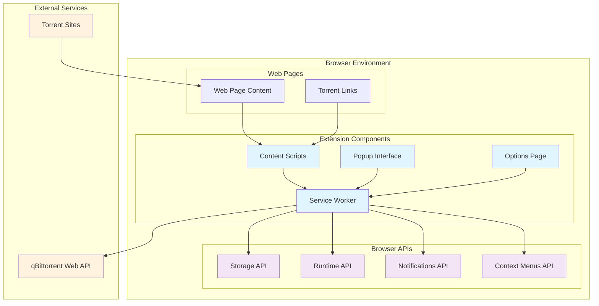
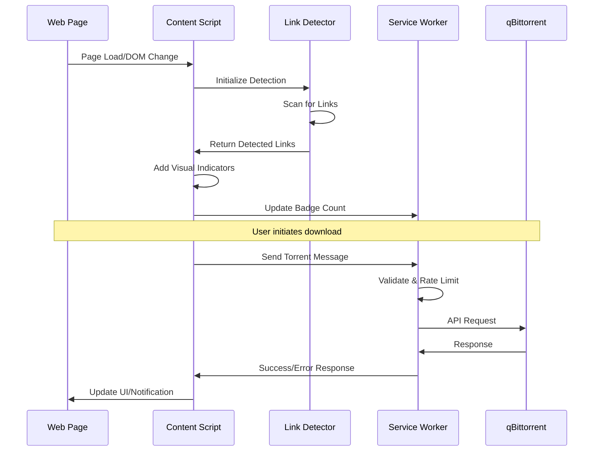
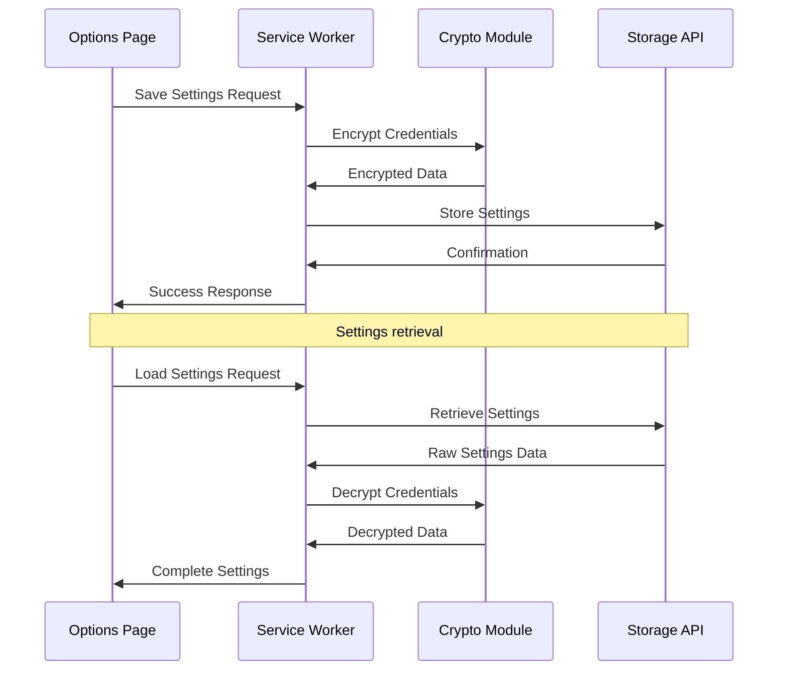
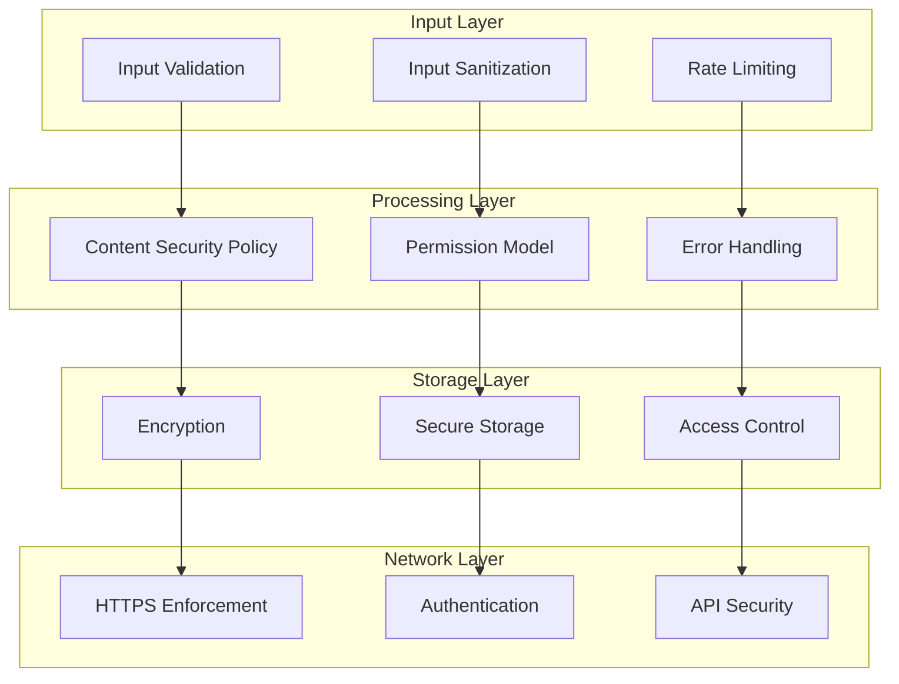
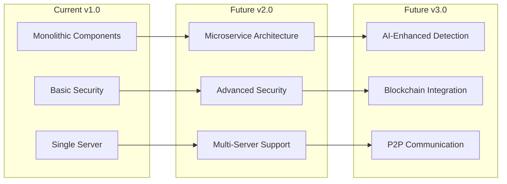

# Architecture Documentation

This document provides a comprehensive overview of the qBittorrent Web Integration browser extension's architecture, design patterns, and technical implementation.

## Table of Contents

1. [System Overview](#system-overview)
2. [Component Architecture](#component-architecture)
3. [Data Flow](#data-flow)
4. [Security Architecture](#security-architecture)
5. [Performance Considerations](#performance-considerations)
6. [Browser Compatibility](#browser-compatibility)
7. [Scalability Design](#scalability-design)
8. [Technology Stack](#technology-stack)

## System Overview

### High-Level Architecture

The qBittorrent Web Integration extension follows a modular, event-driven architecture designed for security, performance, and maintainability.



### Design Principles

1. **Security First**: All components implement security best practices
2. **Modular Design**: Clear separation of concerns between components
3. **Performance Optimized**: Minimal resource usage and efficient algorithms
4. **User Privacy**: No data collection, direct peer-to-peer communication
5. **Cross-Browser Compatibility**: Manifest V3 compliance for modern browsers
6. **Extensible**: Plugin architecture for future enhancements

## Component Architecture

### Service Worker (Background Script)

**Location**: [`background/service-worker.js`](../background/service-worker.js)

The service worker serves as the central coordinator and API gateway:

```javascript
// Core responsibilities
class ServiceWorkerArchitecture {
    constructor() {
        this.apiClient = new QBittorrentAPIClient();
        this.rateLimiter = new RateLimiter();
        this.contextMenus = new ContextMenuManager();
        this.notifications = new NotificationManager();
    }
    
    // Message routing and handling
    async handleMessage(message, sender, sendResponse) {
        // Route messages based on action type
        // Apply rate limiting
        // Handle errors gracefully
        // Return responses
    }
    
    // Context menu integration
    setupContextMenus() {
        // Register context menu items
        // Handle context menu clicks
    }
    
    // Keyboard shortcut handling
    handleKeyboardShortcuts() {
        // Process global shortcuts
        // Coordinate with active tabs
    }
}
```

**Key Features:**
- **Message Routing**: Central hub for all extension communication
- **API Integration**: Manages qBittorrent Web API connections
- **Rate Limiting**: Prevents abuse and ensures stability
- **Context Menus**: Provides right-click functionality
- **Notifications**: User feedback system
- **Persistent State**: Maintains connection and authentication state

### Content Scripts

**Location**: [`content/content-script.js`](../content/content-script.js), [`content/link-detector.js`](../content/link-detector.js)

Content scripts handle web page interaction and torrent detection:

```javascript
// Content script architecture
class ContentScriptArchitecture {
    constructor() {
        this.detector = new TorrentLinkDetector();
        this.observer = new MutationObserver();
        this.eventHandlers = new EventHandlerManager();
    }
    
    // Page scanning and detection
    initializeDetection() {
        // Initial page scan
        // Set up mutation observer
        // Register event handlers
    }
    
    // Dynamic content monitoring
    setupDynamicScanning() {
        // Watch for DOM changes
        // Debounced rescanning
        // Performance optimization
    }
    
    // User interaction handling
    handleUserInteraction() {
        // Click event processing
        // Auto-download logic
        // Visual feedback
    }
}
```

**TorrentLinkDetector Class:**
```javascript
class TorrentLinkDetector {
    constructor() {
        // Regex patterns for detection
        this.magnetPattern = /magnet:\?xt=urn:btih:[a-zA-Z0-9]{32,40}/gi;
        this.torrentPattern = /\.torrent(\?[^"'\s]*)?$/i;
        
        // Efficient storage
        this.detectedLinks = new Set();
        this.linkElements = new WeakMap();
    }
    
    // Detection algorithms
    detectAllLinks() {
        // Magnet link detection
        // Torrent file detection
        // Text content scanning
        // Link validation
    }
    
    // Visual enhancement
    addLinkIndicators() {
        // DOM manipulation
        // Event binding
        // CSS injection
    }
}
```

### Popup Interface

**Location**: [`popup/popup.js`](../popup/popup.js), [`popup/popup.html`](../popup/popup.html)

The popup provides quick access to extension functionality:

```javascript
// Popup architecture
class PopupArchitecture {
    constructor() {
        this.connectionManager = new ConnectionManager();
        this.torrentManager = new TorrentManager();
        this.settingsManager = new SettingsManager();
    }
    
    // Interface initialization
    async initialize() {
        // Load current settings
        // Check connection status
        // Update torrent count
        // Setup event listeners
    }
    
    // Real-time updates
    updateInterface() {
        // Connection status indicator
        // Torrent count display
        // Quick settings sync
    }
}
```

**Interface Components:**
- **Connection Status**: Real-time qBittorrent connectivity
- **Torrent Counter**: Current page torrent detection results
- **Quick Actions**: Send all, refresh, test connection
- **Quick Settings**: Category, save path, torrent state options

### Options Page

**Location**: [`options/options.js`](../options/options.js), [`options/options.html`](../options/options.html)

Comprehensive configuration interface:

```javascript
// Options page architecture
class OptionsArchitecture {
    constructor() {
        this.settingsValidator = new SettingsValidator();
        this.connectionTester = new ConnectionTester();
        this.importExportManager = new ImportExportManager();
    }
    
    // Settings management
    async loadSettings() {
        // Retrieve from storage
        // Populate form fields
        // Handle encryption/decryption
    }
    
    async saveSettings() {
        // Validate input
        // Sanitize data
        // Encrypt sensitive data
        // Store in appropriate storage
    }
    
    // Advanced features
    handleImportExport() {
        // Settings backup/restore
        // JSON serialization
        // Validation on import
    }
}
```

### Utility Modules

**Location**: [`utils/`](../utils/) directory

Shared functionality across components:

#### Encryption Module (`crypto.js`)
```javascript
class CryptoArchitecture {
    // Key management
    static async generateKey() {
        // Web Crypto API usage
        // AES-GCM 256-bit keys
        // Secure random generation
    }
    
    // Encryption/Decryption
    static async encrypt(plaintext) {
        // AES-GCM encryption
        // IV generation
        // Authentication tag
    }
    
    static async decrypt(ciphertext) {
        // Authenticated decryption
        // IV extraction
        // Integrity verification
    }
}
```

#### Validation Module (`validation.js`)
```javascript
class ValidationArchitecture {
    // Input sanitization
    static sanitizeInput(input, type) {
        // Type-specific validation
        // XSS prevention
        // Length limits
        // Character filtering
    }
    
    // URL validation
    static validateServerUrl(url) {
        // Protocol validation
        // Host validation
        // Port range checking
        // Security considerations
    }
}
```

## Data Flow

### Torrent Detection Flow



### Settings Flow



### Message Passing Architecture

```javascript
// Message types and routing
const MESSAGE_TYPES = {
    // Content Script → Service Worker
    SEND_TORRENT: 'SEND_TORRENT',
    SEND_MULTIPLE: 'SEND_MULTIPLE',
    UPDATE_BADGE: 'UPDATE_BADGE',
    
    // Service Worker → Content Script
    GET_ALL_TORRENTS: 'GET_ALL_TORRENTS',
    RESCAN_PAGE: 'RESCAN_PAGE',
    
    // Popup ↔ Service Worker
    TEST_CONNECTION: 'TEST_CONNECTION',
    GET_SERVER_INFO: 'GET_SERVER_INFO',
    
    // Cross-component
    SETTINGS_CHANGED: 'SETTINGS_CHANGED'
};

// Message routing architecture
class MessageRouter {
    constructor() {
        this.handlers = new Map();
        this.middleware = [];
    }
    
    register(messageType, handler) {
        this.handlers.set(messageType, handler);
    }
    
    async route(message, sender, sendResponse) {
        // Apply middleware (rate limiting, validation, etc.)
        for (const middleware of this.middleware) {
            const result = await middleware(message, sender);
            if (!result.continue) {
                return sendResponse(result.response);
            }
        }
        
        // Route to appropriate handler
        const handler = this.handlers.get(message.action);
        if (handler) {
            const result = await handler(message, sender);
            sendResponse(result);
        } else {
            sendResponse({ success: false, error: 'Unknown action' });
        }
    }
}
```

## Security Architecture

### Multi-Layer Security Model



### Threat Model

| Threat | Mitigation | Implementation |
|--------|------------|----------------|
| **XSS Injection** | Input sanitization, CSP | [`utils/validation.js`](../utils/validation.js) |
| **Credential Theft** | AES-256 encryption | [`utils/crypto.js`](../utils/crypto.js) |
| **CSRF Attacks** | SameSite cookies, validation | [`background/api-client.js`](../background/api-client.js) |
| **Man-in-the-Middle** | HTTPS enforcement | Configuration options |
| **Data Exfiltration** | No external connections | Architecture design |
| **Code Injection** | Manifest V3, CSP | [`manifest.json`](../manifest.json) |

### Permission Model

```javascript
// Minimal permission approach
const REQUIRED_PERMISSIONS = {
    storage: 'Settings and preferences',
    notifications: 'User feedback',
    contextMenus: 'Right-click integration',
    activeTab: 'Current page access only'
};

// No broad host permissions
const HOST_PERMISSIONS = []; // Empty by design

// Runtime permission requests
class PermissionManager {
    static async requestTabAccess(tabId) {
        // Request access to specific tab only
        // User-initiated action required
        // Temporary access scope
    }
}
```

## Performance Considerations

### Memory Optimization

```javascript
// Efficient data structures
class PerformanceOptimizations {
    constructor() {
        // WeakMap for DOM element references (automatic cleanup)
        this.linkElements = new WeakMap();
        
        // Set for fast duplicate detection
        this.detectedLinks = new Set();
        
        // Debounced functions for expensive operations
        this.debouncedScan = this.debounce(this.scanPage, 500);
    }
    
    // Memory leak prevention
    cleanup() {
        // Clear references
        // Remove event listeners
        // Cancel pending operations
    }
    
    // Throttling for performance
    debounce(func, wait) {
        let timeout;
        return function executedFunction(...args) {
            const later = () => {
                clearTimeout(timeout);
                func(...args);
            };
            clearTimeout(timeout);
            timeout = setTimeout(later, wait);
        };
    }
}
```

### CPU Optimization

- **Lazy Loading**: Components initialized on demand
- **Debounced Scanning**: Delayed execution for DOM changes
- **Efficient Algorithms**: Optimized regex patterns and DOM queries
- **Background Processing**: Non-blocking operations in service worker

### Network Optimization

```javascript
// Connection pooling and caching
class NetworkOptimization {
    constructor() {
        this.authCache = new Map();
        this.connectionPool = new ConnectionPool();
    }
    
    // Request caching
    async cachedRequest(url, options, ttl = 30000) {
        const cacheKey = this.generateCacheKey(url, options);
        const cached = this.cache.get(cacheKey);
        
        if (cached && (Date.now() - cached.timestamp) < ttl) {
            return cached.response;
        }
        
        const response = await fetch(url, options);
        this.cache.set(cacheKey, {
            response: response.clone(),
            timestamp: Date.now()
        });
        
        return response;
    }
}
```

## Browser Compatibility

### Manifest V3 Implementation

```json
{
    "manifest_version": 3,
    "name": "qBittorrent Web Integration",
    "version": "1.0.0",
    "background": {
        "service_worker": "background/service-worker.js"
    },
    "content_scripts": [{
        "matches": ["<all_urls>"],
        "js": ["utils/constants.js", "content/link-detector.js", "content/content-script.js"],
        "run_at": "document_end"
    }],
    "content_security_policy": {
        "extension_pages": "script-src 'self'; object-src 'none';"
    }
}
```

### Cross-Browser Compatibility Matrix

| Feature | Chrome 88+ | Edge 88+ | Firefox 109+ | Safari |
|---------|------------|----------|--------------|--------|
| **Service Workers** | ✅ | ✅ | ✅ | ❌ |
| **Manifest V3** | ✅ | ✅ | ✅ | ❌ |
| **Web Crypto API** | ✅ | ✅ | ✅ | ✅ |
| **Storage API** | ✅ | ✅ | ✅ | ✅ |
| **Context Menus** | ✅ | ✅ | ✅ | ✅ |
| **Notifications** | ✅ | ✅ | ✅ | ✅ |

### Browser-Specific Adaptations

```javascript
// Browser detection and adaptation
class BrowserAdapter {
    static getBrowserInfo() {
        if (typeof browser !== 'undefined') {
            return { type: 'firefox', api: browser };
        } else if (typeof chrome !== 'undefined') {
            return { type: 'chromium', api: chrome };
        }
        throw new Error('Unsupported browser');
    }
    
    static async adaptStorageAPI() {
        const { type, api } = this.getBrowserInfo();
        
        if (type === 'firefox') {
            // Firefox-specific storage handling
            return new FirefoxStorageAdapter(api);
        } else {
            // Chromium-based browsers
            return new ChromiumStorageAdapter(api);
        }
    }
}
```

## Scalability Design

### Modular Architecture

```javascript
// Plugin system for extensibility
class PluginSystem {
    constructor() {
        this.plugins = new Map();
        this.hooks = new Map();
    }
    
    registerPlugin(plugin) {
        this.plugins.set(plugin.name, plugin);
        
        // Register plugin hooks
        for (const [hookName, handler] of plugin.hooks) {
            if (!this.hooks.has(hookName)) {
                this.hooks.set(hookName, []);
            }
            this.hooks.get(hookName).push(handler);
        }
    }
    
    async executeHook(hookName, ...args) {
        const handlers = this.hooks.get(hookName) || [];
        const results = await Promise.allSettled(
            handlers.map(handler => handler(...args))
        );
        return results;
    }
}
```

### Configuration Management

```javascript
// Centralized configuration system
class ConfigurationManager {
    constructor() {
        this.config = new Map();
        this.validators = new Map();
        this.observers = new Set();
    }
    
    // Type-safe configuration
    define(key, defaultValue, validator) {
        this.config.set(key, defaultValue);
        this.validators.set(key, validator);
    }
    
    async set(key, value) {
        const validator = this.validators.get(key);
        if (validator && !validator(value)) {
            throw new Error(`Invalid value for ${key}`);
        }
        
        this.config.set(key, value);
        await this.notifyObservers(key, value);
    }
    
    get(key) {
        return this.config.get(key);
    }
}
```

## Technology Stack

### Core Technologies

| Component | Technology | Version | Purpose |
|-----------|------------|---------|---------|
| **Manifest** | Manifest V3 | Latest | Extension definition |
| **JavaScript** | ES2022 | Latest | Core logic |
| **Web APIs** | Modern | Latest | Browser integration |
| **Crypto** | Web Crypto API | Latest | Encryption/security |
| **Storage** | Chrome Storage API | Latest | Data persistence |

### Development Tools

| Tool | Version | Purpose |
|------|---------|---------|
| **Jest** | ^29.7.0 | Testing framework |
| **ESLint** | ^9.29.0 | Code linting |
| **Prettier** | ^3.5.3 | Code formatting |
| **Node.js** | 16+ | Development environment |
| **npm** | 8+ | Package management |

### External Dependencies

The extension minimizes external dependencies for security:

- **No runtime dependencies**: All functionality implemented natively
- **Development dependencies only**: Tools for building and testing
- **Web Standards**: Relies on standard browser APIs only

### API Integrations

```javascript
// qBittorrent Web API integration
class QBittorrentAPIClient {
    constructor() {
        this.baseUrl = '';
        this.authCookie = null;
        this.endpoints = {
            login: '/api/v2/auth/login',
            version: '/api/v2/app/version',
            addTorrent: '/api/v2/torrents/add',
            preferences: '/api/v2/app/preferences'
        };
    }
    
    async makeRequest(endpoint, options = {}) {
        const url = `${this.baseUrl}${endpoint}`;
        const requestOptions = {
            ...options,
            headers: {
                ...options.headers,
                'Cookie': this.authCookie
            }
        };
        
        return await fetch(url, requestOptions);
    }
}
```

## Future Architecture Considerations

### Planned Enhancements

1. **WebAssembly Integration**: For performance-critical operations
2. **Offline Capability**: Service worker caching strategies
3. **Advanced Analytics**: Performance monitoring and optimization
4. **Multi-Server Support**: Connection pooling and load balancing
5. **Enhanced Security**: Certificate pinning and additional hardening

### Architectural Evolution



### Migration Strategy

- **Backward Compatibility**: Maintain API stability
- **Incremental Updates**: Feature flags for gradual rollout
- **Data Migration**: Automated upgrade procedures
- **Testing Strategy**: Comprehensive regression testing

---

This architecture documentation provides a complete technical overview of the qBittorrent Web Integration extension. For specific implementation details, refer to the source code and API documentation.